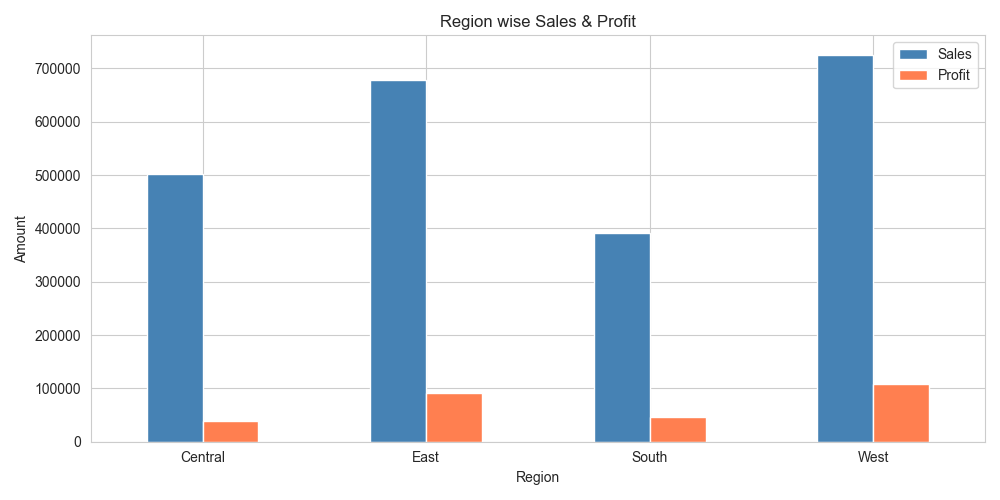
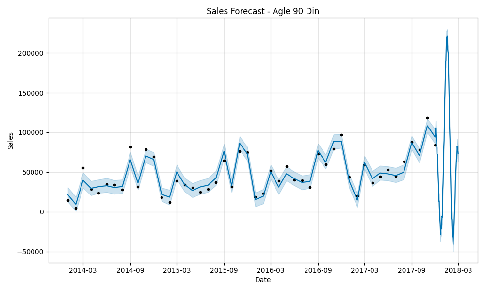

# Smart Retail Analytics Dashboard

## Project Overview
End-to-end retail analytics project using Python, MySQL and Power BI
analyzing 9994 orders with ML sales forecasting.

## Tech Stack
- Python (Pandas, NumPy, Matplotlib, Seaborn)
- MySQL Database
- Power BI Dashboard
- Machine Learning (Prophet Library)

## Project Structure
- 01_load_data.py — Data loading and exploration
- 02_eda.py — Exploratory Data Analysis + 5 graphs
- 03_sql_import.py — MySQL database import
- 04_ml_model.py — Sales forecasting ML model
- 05_check_accuracy.py — Model accuracy check

## Key Results
- Total Sales: 2.30M
- Total Profit: 286.40K
- West region most profitable
- Technology category best performer
- ML Model Accuracy: 97%
- 90-day sales forecast generated

## Dashboard Preview

